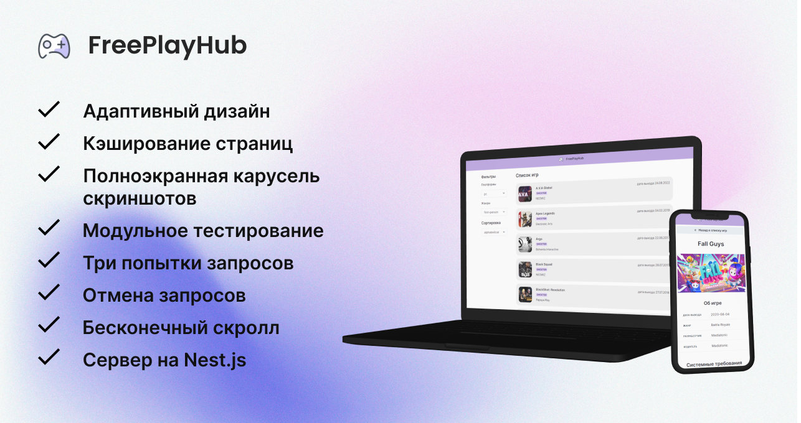

<a name="readme-top"></a>

<div align="center">
  <a href="https://github.com/alyona-korenkovich/FreePlayHub">
    
  </a>

<h3 align="center">FreePlayHub</h3>

  <p align="center">
    A clone of the FreeToGame free games store, completed as a test task for the Avito 2023 internship
    <br />
    <br />
    <a href="https://alyona-korenkovich.github.io/FreePlayHub">Live demo</a>
    ·
    <a href="https://github.com/avito-tech/frontend-trainee-assignment-2023">Project requirements</a>
    ·
    <a href="https://alyona-korenkovich.github.io/FreePlayHub">Showcase</a>
    ·
    <a href="https://github.com/alyona-korenkovich/FreePlayHub/issues?q=is%3Aissue+is%3Aclosed">Issues</a>
  </p>

  <a href="https://github.com/alyona-korenkovich/FreePlayHub/actions/workflows/frontend.yml">
    
  </a>
</div>

<!-- TABLE OF CONTENTS -->
<details>
  <summary>

  ## 🚀 Table of Contents
  </summary>
  <ol>
    <li><a href="#about-the-project">About The Project</a></li>
    <li><a href="#built-with">Built with</a></li>
    <li><a href="#showcase">Showcase</a></li>
    <li><a href="#getting-started">Getting started</a></li>
    <li><a href="#roadmap">Roadmap</a></li>
    <li><a href="#license">License</a></li>
    <li><a href="#contact">Contact</a></li>
    <li><a href="#acknowledgments">Acknowledgments</a></li>
  </ol>
</details>

<!-- ABOUT THE PROJECT -->
## About The Project



This project is a clone of the FreeToGame store that provides free games. 

Here you will find a wide selection of free games for various platforms and genres.

### Features:

🏡 <b>Main page with filtering and sorting</b>

The main page displays a list of games that can be filtered by platform and genre. 

Games can also be sorted by release date, popularity, and more.

🎮 <b>Game Detail Page</b>

Clicking on a game takes the user to a detailed page where detailed information about the game is available, such as title, release date, publisher, developer, genre, image, screenshots, and system requirements.

⚙ <b>User-friendly interface</b>

Through the use of ChakraUI, the components are stylistically consistent, support keyboard navigation, and follow accessibility best practices (a11y).

Moreover, loading indicators and error messages provide a more positive and informative user experience.

📱 <b>Adaptive interface</b>

The application adapts to work on different devices, including mobile screens and desktops.

✅ <b>Optimized performance</b>

To optimize the performance of the application, a data lazy loading mechanism has been implemented, which allows you to load data only as needed.

Also, the application implements caching of downloaded data with a lifetime of 5 minutes.

<p align="right">(<a href="#readme-top">back to top</a>)</p>

<!-- BUILT WITH -->
## Built with


* 
* 
* 
* 
* 
* 
* 
* 
* 

<p align="right">(<a href="#readme-top">back to top</a>)</p>

<!-- SHOWCASE -->
## Showcase


See how pages look on desktop/mobile:


.. or test it yourself on <a href="https://alyona-korenkovich.github.io/FreePlayHub">live demo</a>!

<p align="right">(<a href="#readme-top">back to top</a>)</p>

<!--GETTING STARTED -->
## Getting started


### Clone the project
`git clone https://github.com/alyona-korenkovich/FreePlayHub`

### Go to the client directory
`cd client`

### Touch and edit `.env` file
Create in `<root>/client` directory `.env` file and add the following variables:

```bash
PORT=3001
REACT_APP_X_RAPIDAPI_KEY=e9847a112amsha6daa9416ea8662p1adc7ajsn3d0cb03c40fb
```

It is needed to
* access site on `localhost:3001`
* access FreeToGame API endpoints

### Start development server

`npm start`

### Open `localhost:3001` on your browser
...and enjoy FreePlayHub!

<p align="right">(<a href="#readme-top">back to top</a>)</p>

<!-- ROADMAP -->
## Roadmap


- 🌟 Init GitHub project and start working 🌟
---
- [x] #1 Basic project setup
  - Download, install, and configure libraries, set up file structure
  - Configure redux-store and react routing
  - Add GameList, GameCard, and ScreenshotCarousel components
- [x] #2 Filters & Sorters
  - Add GameFilter and GameSorter components, integrate them into GameList component 
- [x] #3 Loadings & Errors
  - Add loading indicator and error display
- [x] #4 Caching
  - Store loaded data about specific games in a local state 
- [x] #5 Adaptive Design
    - Add meta tags and media queries to adapt the app for mobile devices 
---
- 🌟 First release and deployment to GitHub Pages 🌟
---
- [x] #6 Endless Scroller
  - Data lazy-loading and endless game list
- [x] #7 Try-3-Times requests
  - If the request is unsuccessful, there must be three attempts to re-request
- [x] #8 Cancel Requests
  - Cancel outdated requests when redirecting pages
- [x] #9 Testing
  - Add unit tests
  - Add GitHub workflows and support GitHub Actions
---
- 🌟 Second release 🌟
---
- [ ] #10 Requests encapsulation in Node
  - Setup server on Node.js and encapsulate API requests
---
- 🌟 Third release and deployment to Heroku 🌟
---

👀 See the [issues](https://github.com/alyona-korenkovich/FreePlayHub/issues) for a full list with more details.

😉 Also, you may be interested in seeing [pull requests](https://github.com/alyona-korenkovich/FreePlayHub/pulls?q=is%3Apr+is%3Aclosed) for some details on realization of some features.

<p align="right">(<a href="#readme-top">back to top</a>)</p>

<!-- LICENSE -->
## License


Distributed under the MIT License. 

See `LICENSE` for more information.

<p align="right">(<a href="#readme-top">back to top</a>)</p>

<!-- CONTACT -->
## Contact


Alyona Korenkovich - tg: [@cri_decoeur](https://t.me/cri_decoeur) - al.korenkovich@mail.ru

Project Link: [github.com/alyona-korenkovich/FreePlayHub](https://github.com/alyona-korenkovich/FreePlayHub)

<p align="right">(<a href="#readme-top">back to top</a>)</p>

<!-- ACKNOWLEDGMENTS -->
## Acknowledgments


Some helpful links:

* [FreeToGame - original](www.freetogame.com)
* [FreeToGame API](https://www.freetogame.com/api-doc)

<p align="right">(<a href="#readme-top">back to top</a>)</p>